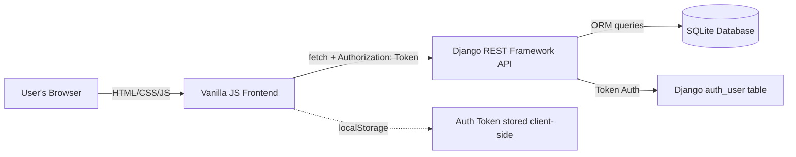
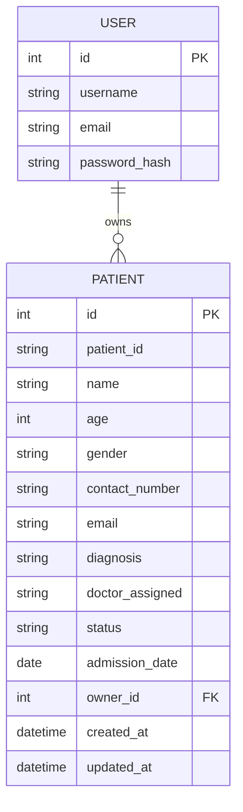
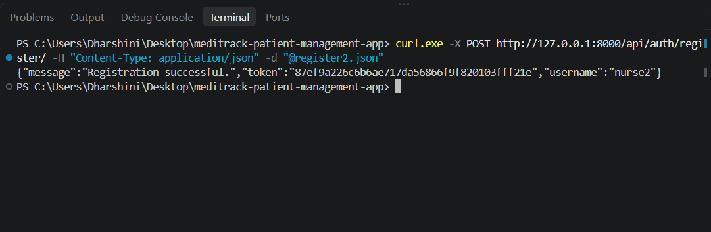
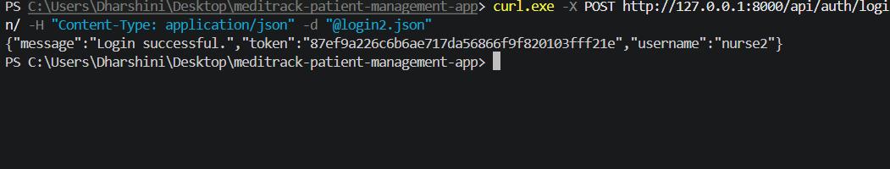
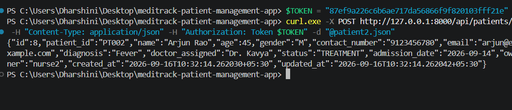
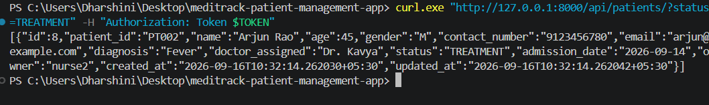

# Project Report — MediTrack: Hospital Patient Management System

## 1. Title
**MediTrack** — A Full-Stack CRUD Web Application for Hospital Patient Record Management

## 2. Problem Statement
Hospitals and clinics need a reliable way to record, update, and track patient information —
admission status, assigned doctor, and diagnosis — without relying on paper registers or
disconnected spreadsheets. Manual record-keeping is slow, error-prone, and makes it hard to
search for a patient's current status at a glance. This project addresses that gap with a
lightweight, self-hosted web application any small clinic or hospital ward can run locally.

## 3. Objectives
- Allow authorized staff to securely register and log in to the system (no shared/default login).
- Provide full CRUD (Create, Read, Update, Delete) operations on patient records.
- Allow searching patients by name, patient ID, diagnosis, or doctor, and filtering by status.
- Enforce validation both on the client (immediate feedback) and server (data integrity).
- Keep each staff member's records scoped to their own account.
- Demonstrate a clean separation between frontend, REST API, and database layers.

## 4. Technology Stack

| Layer | Technology | Purpose |
|---|---|---|
| Frontend | HTML5, CSS3, Vanilla JavaScript | UI, forms, client-side validation, API calls via `fetch` |
| Backend | Django 5 + Django REST Framework | REST API, business logic, server-side validation |
| Authentication | DRF Token Authentication | Per-user login; no default/shared login |
| Database | SQLite | Persistent storage (swappable for MySQL/PostgreSQL) |
| API Testing | curl / Postman | Manual endpoint verification |
| Version Control | Git & GitHub | Source control and submission |

## 5. System Architecture

**Flow:**
1. The browser loads static frontend files (`index.html`, `register.html`, `dashboard.html`).
2. On register/login, the frontend calls the Django REST API, which returns an auth token.
3. The token is stored in `localStorage` and attached to every subsequent API request.
4. The dashboard performs CRUD operations against `/api/patients/`, all scoped to the logged-in user.

## 6. Entity-Relationship Diagram

- **One-to-many**: one `User` (hospital staff account) can own many `Patient` records.
- `patient_id` is unique across the whole system to prevent duplicate registrations.
- `status` is restricted to `ADMITTED`, `TREATMENT`, or `DISCHARGED`.

## 7. REST API Endpoints

| Operation | Method | Endpoint | Auth Required |
|---|---|---|---|
| Register | POST | `/api/auth/register/` | No |
| Login | POST | `/api/auth/login/` | No |
| Logout | POST | `/api/auth/logout/` | Yes |
| List / Search / Filter patients | GET | `/api/patients/?search=&status=` | Yes |
| Create patient | POST | `/api/patients/` | Yes |
| Retrieve one patient | GET | `/api/patients/{id}/` | Yes |
| Update patient | PUT/PATCH | `/api/patients/{id}/` | Yes |
| Delete patient | DELETE | `/api/patients/{id}/` | Yes |

## 8. CRUD Functional Requirements

| Function | User Action | Expected Result |
|---|---|---|
| Create | Fill "Add Patient" form and submit | New record appears in the table and database |
| Read | Open dashboard / search / filter | Matching records are displayed |
| Update | Click Edit, change fields, save | Updated values reflected immediately |
| Delete | Click Delete, confirm | Record removed from table and database |

## 9. Validation Implemented
- **Client-side:** required fields, email format, password match, age range (1–130), contact
  number digit format, patient ID presence — all give instant inline feedback.
- **Server-side (independent of client):** DRF serializers re-validate every field; unique
  constraints on `username`, `email`, and `patient_id`; password strength via Django's built-in
  validators; ownership check so one user cannot edit/view another user's patients.

## 10. Testing Performed

| Test Case | Method | Result |
|---|---|---|
| Register with valid data | POST `/api/auth/register/` | 201 Created, token returned |
| Register with duplicate username | POST `/api/auth/register/` | 400 Bad Request, field error |
| Login with correct credentials | POST `/api/auth/login/` | 200 OK, token returned |
| Login with wrong password | POST `/api/auth/login/` | 400 Bad Request, invalid credentials |
| Create patient (authenticated) | POST `/api/patients/` | 201 Created, record persisted |
| List patients (unauthenticated) | GET `/api/patients/` | 401 Unauthorized |
| Search patients | GET `/api/patients/?search=fracture` | Filtered results returned |
| Filter by status | GET `/api/patients/?status=ADMITTED` | Only admitted patients returned |
| Update patient | PUT `/api/patients/{id}/` | 200 OK, fields updated |
| Delete patient | DELETE `/api/patients/{id}/` | 204 No Content, record removed |

All endpoints above were manually verified end-to-end with `curl` before submission
(register → login → create → list/filter → auth-protection check).
### Test Evidence

## 11. Challenges & Solutions

| Challenge | Solution |
|---|---|
| Frontend and backend run on different origins/ports, causing browser CORS errors | Added `django-cors-headers` with `CORS_ALLOW_ALL_ORIGINS = True` for local development |
| Needed to prevent one user from seeing another's patient records | Added an `owner` foreign key to `Patient` and filtered every queryset by `request.user` |
| Avoiding a default/bypass login while keeping the flow simple | Built a dedicated `RegisterView` that immediately issues a token, so registration doubles as first login |
| Keeping validation consistent between browser and server | Duplicated the same rules (required fields, regex patterns, ranges) in both `app.js` and DRF serializers |

## 12. Future Enhancements
- Pagination and sorting on the patient list for large datasets.
- Role-based access (e.g., doctor vs. receptionist permissions).
- Patient photo/document upload.
- Audit log of who edited/deleted each record and when.
- Deployment guide for a production database (PostgreSQL) and hosting (e.g., Render/Railway + Netlify).
- Dashboard analytics (e.g., patient count by status, admissions per month).

## 13. Repository
GitHub: `https://github.com/Dharshinipa-CSE/Meditrack-patient-management`

## 14. Conclusion
MediTrack fulfills all core CRUD, authentication, validation, and REST API requirements
defined in the SOP, using a clean separation between a vanilla JavaScript frontend and a
Django REST Framework backend, with automated ownership-based data isolation between users.
